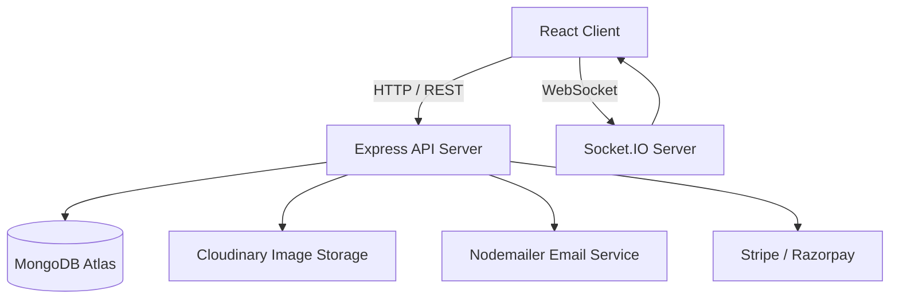

# 🌟 Lumina — Premium E-Commerce Marketplace

[]()
[]()
[]()
[]()
[]()

> A production-ready, full-stack MERN e-commerce platform with enterprise-level architecture, premium UI, and complete feature set.


---

## 🚀 Tech Stack

### Frontend
| Technology | Purpose |
|---|---|
| React 19 + Vite | Core UI framework |
| Tailwind CSS | Styling & design system |
| Redux Toolkit + Persist | State management |
| React Router DOM v6 | Client-side routing |
| Framer Motion | Animations |
| React Hook Form + Zod | Forms & validation |
| Swiper.js | Product carousels |
| Chart.js | Analytics charts |
| Socket.io Client | Real-time features |
| Axios | HTTP client |

### Backend
| Technology | Purpose |
|---|---|
| Node.js + Express | REST API server |
| MongoDB + Mongoose | Database & ODM |
| JWT + bcryptjs | Authentication |
| Cloudinary + Multer | Image storage |
| Nodemailer | Email service |
| Socket.io | Real-time events |
| Razorpay / Stripe | Payments |
| Helmet + Rate Limit | Security |

---

## 📁 Project Structure

```
lumina/
├── client/                    # React frontend
│   ├── src/
│   │   ├── components/
│   │   │   ├── layout/        # Navbar, Footer
│   │   │   ├── product/       # ProductCard, QuickView
│   │   │   ├── cart/          # CartDrawer
│   │   │   └── common/        # PageLoader, etc.
│   │   ├── pages/
│   │   │   ├── auth/          # Login, Register, etc.
│   │   │   ├── dashboard/     # User dashboard pages
│   │   │   ├── seller/        # Seller dashboard
│   │   │   └── admin/         # Admin panel
│   │   ├── redux/
│   │   │   └── slices/        # Auth, Cart, Wishlist, Product, UI
│   │   ├── services/          # API service classes
│   │   ├── routes/            # Route config + ProtectedRoute
│   │   └── layouts/           # Main, Dashboard, Seller, Admin layouts
│   └── tailwind.config.js
│
└── server/                    # Express backend
    ├── controllers/           # Business logic
    ├── models/                # Mongoose schemas
    ├── routes/                # API routes
    ├── middlewares/           # Auth, error handling
    ├── services/              # Email service
    ├── config/                # DB, Cloudinary
    └── utils/                 # Seeder, helpers, logger
```

### System Architecture



---

## ✨ Features

### 🛍️ Customer
- Browse & search 50,000+ products
- Advanced filters (category, price, rating, brand)
- Product quick view & zoom gallery
- Cart with coupon support
- Multi-step checkout (Razorpay, Stripe, UPI, COD)
- Order tracking with real-time updates
- Wishlist sync across devices
- Review & rating system with images
- Loyalty reward points
- Email notifications

### 🏪 Seller
- Product management (CRUD with Cloudinary images)
- Order management & status updates
- Inventory tracking & low-stock alerts
- Sales analytics dashboard
- Real-time order notifications via Socket.io

### 🔧 Admin
- Full user management (activate/suspend/delete)
- Seller approval workflow
- Product moderation
- Category & subcategory management
- Coupon creation & management
- Revenue reports & analytics
- Order oversight

---

## 🎨 Design System

```js
colors: {
  primary:   '#2563EB',   // Blue
  secondary: '#0F172A',   // Dark navy
  accent:    '#8B5CF6',   // Purple
  surface:   '#F8FAFC',   // Light gray bg
  brand:     '#111827',   // Text
}
fonts: {
  sans:    'Inter',
  display: 'Poppins',
}
```

---

## ⚙️ Getting Started

### Prerequisites
- Node.js 18+
- MongoDB Atlas account
- Cloudinary account
- Razorpay account (for payments)

### 1. Clone & Install

```bash
git clone <repo-url>
cd lumina
npm run install-all
```

### 2. Configure Environment

```bash
# Server
cp server/.env.example server/.env
# Edit server/.env with your credentials

# Client
cp client/.env.example client/.env.local
# Edit client/.env.local
```

### 3. Seed Database

```bash
cd server
node utils/seeder.js
```

**Default credentials after seeding:**
| Role | Email | Password |
|------|-------|----------|
| Admin | admin@lumina.shop | Admin@123 |
| Seller | seller@lumina.shop | Seller@123 |
| Customer | customer@lumina.shop | Customer@123 |

### 4. Run Development

```bash
# Root — runs both client and server
npm run dev

# Or separately:
npm run client   # localhost:3000
npm run server   # localhost:5000
```

---

## 🌐 API Reference

### Auth
| Method | Endpoint | Auth |
|--------|----------|------|
| POST | `/api/auth/register` | — |
| POST | `/api/auth/login` | — |
| POST | `/api/auth/logout` | ✅ |
| GET | `/api/auth/me` | ✅ |
| PUT | `/api/auth/profile` | ✅ |
| POST | `/api/auth/forgot-password` | — |
| POST | `/api/auth/reset-password/:token` | — |

### Products
| Method | Endpoint | Auth |
|--------|----------|------|
| GET | `/api/products` | — |
| GET | `/api/products/featured` | — |
| GET | `/api/products/trending` | — |
| GET | `/api/products/:id` | — |
| POST | `/api/products` | Seller |
| PUT | `/api/products/:id` | Seller |
| DELETE | `/api/products/:id` | Seller |
| POST | `/api/products/:id/reviews` | Customer |

### Orders
| Method | Endpoint | Auth |
|--------|----------|------|
| POST | `/api/orders` | Customer |
| GET | `/api/orders/my-orders` | Customer |
| GET | `/api/orders/:id` | Customer |
| PUT | `/api/orders/:id/cancel` | Customer |

### Admin
| Method | Endpoint | Auth |
|--------|----------|------|
| GET | `/api/admin/stats` | Admin |
| GET | `/api/admin/users` | Admin |
| PUT | `/api/admin/users/:id/status` | Admin |
| GET | `/api/admin/orders` | Admin |
| POST | `/api/admin/categories` | Admin |
| POST | `/api/coupons` | Admin |

---

## 🚢 Deployment

### Frontend (Vercel)
```bash
cd client
npm run build
# Deploy dist/ to Vercel
```

### Backend (Render)
1. Push server/ to GitHub
2. Create Render Web Service
3. Set environment variables
4. Build command: `npm install`
5. Start command: `node server.js`

### Database (MongoDB Atlas)
1. Create cluster on MongoDB Atlas
2. Whitelist IPs (0.0.0.0/0 for production)
3. Copy connection string to `MONGO_URI`

---

## 🔐 Security Features

- JWT access + refresh token system
- bcryptjs password hashing (12 rounds)
- Rate limiting (100 req/15min global, 20 for auth)
- MongoDB query sanitization
- HTTP Parameter Pollution protection
- Helmet security headers
- CORS policy enforcement
- XSS protection
- Input validation with Zod (frontend) + Mongoose (backend)

---

## 📧 Email Features

All emails use premium branded HTML templates:
- ✅ Email verification on signup
- 🔑 Password reset link
- 📦 Order confirmation
- 🚚 Shipping notification
- 💰 Refund confirmation

---

## 🔔 Real-Time (Socket.io)

| Event | Trigger | Listener |
|-------|---------|----------|
| `orderCreated` | New order placed | Customer |
| `orderStatusUpdate` | Status changed | Customer |
| `paymentSuccess` | Payment verified | Customer |
| `newOrder` | Order received | Seller |
| `lowStock` | Stock < 10 | Seller |

---

## 📄 License

MIT License — feel free to use this project commercially.

---

**Built with ❤️ using MERN Stack**
